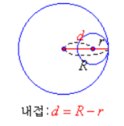
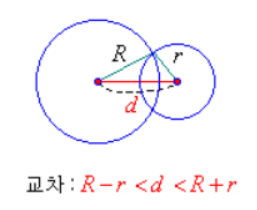

1. There is **no** intersection of two circles.

   - Inclusion
     ​

     
   - Segregation.
     ​

     ​
     

2. There is **one** intersection of two circles.

   - Inward
     ​

     
   - Circumscription
     ​

     

3. There is **two** intersection of two circles.

   - Intersection
     ​

      

4. There is **infinite** intersection of two circles.

   - Two identical circles.

   ​

